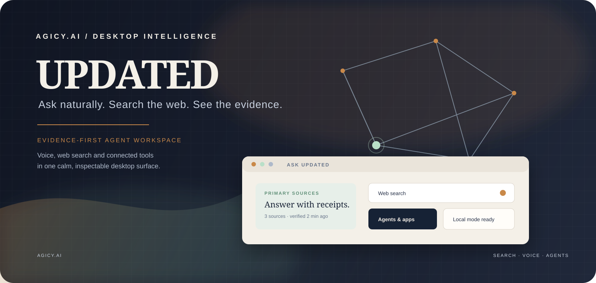

<p align="center">
  
</p>

<p align="center">
  
</p>

<p align="center">
  <a href="LICENSE"></a>
  <a href="https://github.com/AGiOS-Ai-EU/UPDATED/releases"></a>
  
  
</p>

# UPDATED

**Ask naturally. Search the web. See the evidence. Connect the right agent.**

UPDATED is AGICY.Ai’s desktop intelligence workspace. It combines a fast conversational surface with sourced web search, voice input, local history and connected tools. Answers remain inspectable: sources are separated, provider disagreement is explicit, and external actions can require confirmation.

The redesigned workspace is movable, resizable and minimizable. It replaces the old floating popover with labelled navigation for Ask UPDATED, Web search, History, Agents & apps and Knowledge, while keeping the quick companion available for capture.


**Supported desktop for this beta is Windows.** That is the machine we install and test. macOS and Linux files on the GitHub release are CI artifacts, not a supported install path.

## Product page (no public installer)

[English](https://agicy.ai/updated?lang=en) ·
[简体中文](https://agicy.ai/updated?lang=zh) ·
[हिन्दी](https://agicy.ai/updated?lang=hi) ·
[Deutsch](https://agicy.ai/updated?lang=de) ·
[Español](https://agicy.ai/updated?lang=es) ·
[Ελληνικά](https://agicy.ai/updated?lang=el) ·
[Italiano](https://agicy.ai/updated?lang=it) ·
[Français](https://agicy.ai/updated?lang=fr)

[agicy.ai/updated](https://agicy.ai/updated) is the product / language page. **It does not offer public installer downloads** (those buttons were removed). Invited testers pair a device at [agicy.ai/updated/my_device](https://agicy.ai/updated/my_device).

## Install the Windows beta

Current redesign line: **UPDATED 0.9.0-beta.8**.

Download the Windows installer from GitHub only:

Public binaries are published on the [UPDATED Releases page](https://github.com/AGiOS-Ai-EU/UPDATED/releases) when a release is cut.

The redesigned test package is unsigned. Native helper support depends on the compiler toolchain used to package the build; the Electron fallback remains available.

> [!WARNING]
> This beta installer is **unsigned** unless CI signing secrets were set for that run (see [docs/CODE_SIGNING.md](docs/CODE_SIGNING.md)). **Windows SmartScreen** may warn on first open: **More info → Run anyway**. Verify the file comes from `AGiOS-Ai-EU/UPDATED` on GitHub.

### Windows

1. Download the current Windows asset from the GitHub Releases page above.
2. If SmartScreen appears, choose **More info**, then **Run anyway**.
3. Launch UPDATED and allow microphone access.

### Other OS files on the same tag (not supported)

The GitHub pre-release also attaches macOS `.dmg` / `.zip` and Linux `.AppImage` / `.deb`. Those are **untested CI artifacts**. Do not treat them as a supported or smoke-tested product for this beta.

## First run (0.9.0-beta.8)

1. **SmartScreen** — unsigned setup.exe; **More info → Run anyway** if Windows warns.
2. Launch UPDATED, allow microphone access, and open the workspace from the companion or summon shortcut.

Sign in opens [agicy.ai/updated/my_device](https://agicy.ai/updated/my_device): the app shows a device code and opens `https://agicy.ai/updated/my_device?user_code=?`. Sign in with your AGICY email, confirm the code, approve the device.

**Cost (say this before you install):** Voice uses **metered inference credits** on your AGICY account. New accounts receive a free allotment (see [agicy.ai/updated/usage](https://agicy.ai/updated/usage) after sign-in). Search itself is free; optional Brave Search uses **your** Brave key. The app is not “unlimited free cloud STT.”

Cloud sign-in is optional for local search and local workflows. Voice transcription is hosted by AGICY in this beta. If cloud sign-in is temporarily unavailable, the workspace stays usable and shows a retryable status instead of implying that voice is offline.

## How voice works in 0.9.0-beta.8 (canonical)

Full diagram: [docs/VOICE-DATA-FLOW.md](docs/VOICE-DATA-FLOW.md). Privacy notice draft: [PRIVACY.md](PRIVACY.md).

```
Mic → UPDATED app → https://agicy.ai/api/stt/transcribe → Deepgram EU → transcript back to app
```

| Mode | Behavior in this installer |
| --- | --- |
| Dictation | Hotkey → mic → **AGICY hosted STT (Deepgram EU)** → paste or clipboard |
| Search | Hotkey → mic → **AGICY hosted STT (Deepgram EU)** → multi-provider search → citation cards |
| Primary-source rate | Shown as `primary / total`, including `0 / N` |
| CONTESTED | Jaccard similarity below `0.35`; providers remain separated |
| Search history | Last 30 queries stored **locally** |
| Divergence log | Append-only JSONL **locally** — Settings → Search → Reveal / Copy path |
| Brave key | Optional; encrypted with Electron `safeStorage` |

Without a Brave Search API key, the local search surface remains available for interface testing; live provider availability is shown in the workspace.

Music recognition is available when the server operator sets `AUDD_API_TOKEN`.
The Electron client never receives this token: it uploads a short recording to
the AGICY server, which calls AudD and returns normalized track metadata. The
request is listed in the local transparency ledger. If the token is not set,
the button remains available but reports that recognition is not configured.

Odesli/Songlink API enrichment is intentionally not enabled: its public
`v1-alpha.1` API is deprecated, so the first music pass returns AudD metadata
and its canonical song link only. A replacement link provider can be added
behind the same server adapter later.

On-device STT, a full Agent Room and conversational Maps control remain staged work rather than features of the current Windows test build.

## Shipping now vs next

| --- | --- |
| In the **0.9.0-beta.8** redesign line | Staged next |
| Movable workspace shell, sourced search, voice input, local history and connected-app surface | Full Agent Room with visible specialist-agent progress |
| Local-mode recovery when AGICY cloud sign-in is unavailable | Conversational Maps control and richer agent hand-off |
| Unsigned Windows test installer (SmartScreen may warn) | Signed releases and native helper toolchains in CI |

## Third-party services and privacy

This beta is **not** local-first for voice. Audio leaves the device.

| Service | Required for | Data sent |
| --- | --- | --- |
| **AGICY** (`agicy.ai`) | Sign-in + hosted STT + credit metering | Account session, **microphone audio**, usage events |
| **Deepgram EU** (via AGICY) | Speech-to-text | Audio for the transcription request (sub-processor) |
| **Brave Search** (optional) | Live web search | Search query text + your API key (key stored encrypted locally) |
| **PostHog US** (`us.i.posthog.com`) | Anonymous product analytics in this build | Usage events unless you turn telemetry off in settings (`telemetry_enabled`) |

Analytics and cloud-service behaviour can vary by build configuration. Review the bundled privacy disclosure and Settings before enabling hosted voice or connected services.

Controller: AGICY.Ai (EU). Draft product privacy: [PRIVACY.md](PRIVACY.md). Canonical web notice (when published): [agicy.ai/legal/privacy](https://agicy.ai/legal/privacy). Data-subject requests: privacy@agicy.ai.

Search history and divergence logs stay on your machine. Voice audio does not — until local STT ships in a later build.

## Build from source

Requires Node.js 22+, pnpm 10.32.1, and the native compiler toolchain for your operating system.

```powershell
git clone https://github.com/AGiOS-Ai-EU/UPDATED.git
cd UPDATED
pnpm install
pnpm --filter @freestyle-voice/electron run compile:native
pnpm --filter @freestyle-voice/electron run dev
```

Windows installer locally: `pnpm --filter @freestyle-voice/electron run build:win`.

## Architecture and status

- [`docs/ARCHITECTURE-MAP.md`](docs/ARCHITECTURE-MAP.md)
- [`docs/SEARCH-ARCHITECTURE.md`](docs/SEARCH-ARCHITECTURE.md)
- [`docs/VOICE-DATA-FLOW.md`](docs/VOICE-DATA-FLOW.md) — **canonical STT / privacy path**
- [`docs/STT-MIGRATION-PLAN.md`](docs/STT-MIGRATION-PLAN.md) — hosted today; local whisper is planned, not shipped
- [`PRIVACY.md`](PRIVACY.md) — GDPR-oriented product disclosure (draft)
- [`docs/ROADMAP.md`](docs/ROADMAP.md)
- [`docs/CHANGES.md`](docs/CHANGES.md)
- [`docs/CODE_SIGNING.md`](docs/CODE_SIGNING.md)

The Windows beta is actively evolving. On-device STT, a full Agent Room, conversational Maps control, signed installers and additional connected workflows are staged work rather than promises of the current binary.

## License and credits

[MIT](LICENSE). See [NOTICE](NOTICE) for attribution and third-party service disclosure.
